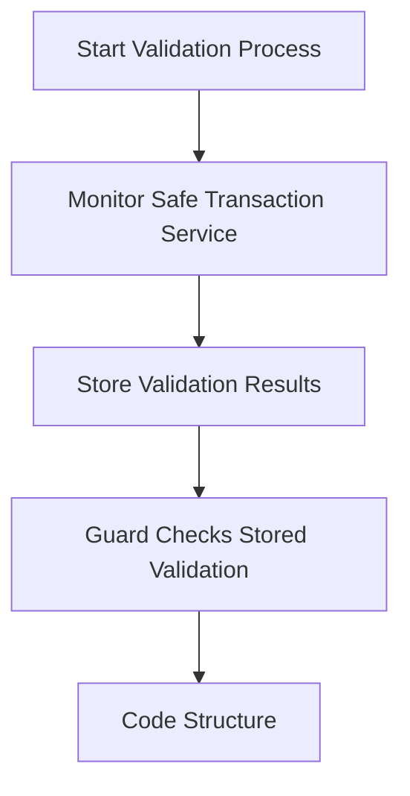

# Safe Guard Demo

A demo where an AVS serves as a Safe Guard for a Safe.

TODO:

- [ ] Use a better Safe Guard base like [borg-core](https://github.com/MetaLex-Tech/borg-core)
- [ ] A more useful predicate function component (instead of just returning true)
- [ ] Explore a cron trigger that pulls the Safe API

Reading and Resources:

- [Zodiac](https://www.zodiac.wiki/documentation): a bunch of useful extensions to the Safe. If you're looking for examples of extending Safe, Zodiac has a ton of them.
- [Safe Modules](https://docs.safe.global/advanced/smart-account-modules): documentation on Safe Modules, allowing easily extending functionality of a Safe.
- [Safe Guard](https://docs.safe.global/advanced/smart-account-guards): documentation on Safe Guards, allowing for checks on Safe transactions.

## Gnosis Safe Async Validation Summary

### Key Findings

- Pure async validation in Safe guards is not possible since checkTransaction must be synchronous
- A two-step validation process is required: validate first, then execute
- Validation state must be stored on-chain for the guard to access it
- Can leverage existing Safe events/APIs to improve UX by starting validation early via an AVS

### Triggering the Validation Process

There are a few approaches to triggering the validation process via an AVS.

1. **ApproveHash**

```solidity
event ApproveHash(bytes32 indexed approvedHash, address indexed owner)
```

- Emitted when an owner signs a transaction on-chain
- Can use this to trigger validation during signature collection
- Only works for on-chain signatures

2. **Safe Transaction Service APIs**

Pending Transaction Monitoring:

```
// Get pending transactions
GET /api/v1/safes/{address}/multisig-transactions/?executed=false

// Webhook payload for new proposals
{
    type: "PENDING_MULTISIG_TRANSACTION",
    safeTxHash: string,
    address: string
    // ...
}
```

Transaction Status:

```
// Get specific transaction
GET /api/v1/multisig-transactions/{safeTxHash}/
```

### Recommended Implementation Pattern



1. Monitor Safe Transaction Service for new proposals (via an AVS)
2. Start validation process immediately on new proposals
3. Store results on-chain via validation contract (custom Safe Guard)
4. Guard checks stored validation during execution

### Best Practices

- Include validation expiry timestamps
- Clean up old validation state
- Consider gas costs of storage
- Handle both on-chain and off-chain signature cases
- Start validation as early as possible in transaction lifecycle

This approach provides the best balance of security and UX while working within the constraints of the Safe's guard mechanism.

## Instructions

> Install [`cargo install cargo-component --locked`](https://github.com/bytecodealliance/cargo-component#installation) if you have not already.

```bash
# Install initial dependencies.
make setup

# Build the contracts and WASI components.
make build

# Run the tests.
make test
```

### Start Anvil and WAVS

> On MacOS Docker, ensure you've either enabled host networking (Docker Engine -> Settings -> Resources -> Network -> 'Enable Host Networking') or installed [docker-mac-net-connect](https://github.com/chipmk/docker-mac-net-connect) via `brew install chipmk/tap/docker-mac-net-connect && sudo brew services start chipmk/tap/docker-mac-net-connect`.

```bash
# Copy over the .env file.
cp .env.example .env

# Start all services.
make start-all
```

> The `start-all` command must remain running in your terminal. Use another terminal to run other commands.
>
> You can stop the services with `ctrl+c` (you may have to press it twice).

### Deploy contracts

```bash
forge script script/SafeGuard.s.sol:DeploySafeGuardScript --rpc-url http://localhost:8545 --broadcast

# Load the created addresses into the environment
export SAFE_ADDRESS=$(cat .env | grep SAFE_ADDRESS | tail -1 | cut -d '=' -f 2)
export GUARD_ADDRESS=$(cat .env | grep GUARD_ADDRESS | tail -1 | cut -d '=' -f 2)
# fish shell:
# set -gx SAFE_ADDRESS (cat .env | grep SAFE_ADDRESS | tail -1 | cut -d '=' -f 2)
# set -gx GUARD_ADDRESS (cat .env | grep GUARD_ADDRESS | tail -1 | cut -d '=' -f 2)
```

### Deploy service component

```bash
COMPONENT_FILENAME=safe_guard.wasm SERVICE_TRIGGER_ADDR=$SAFE_ADDRESS SERVICE_SUBMISSION_ADDR=$GUARD_ADDRESS TRIGGER_EVENT="ApproveHash(bytes32,address)" make deploy-service
```

### Trigger the validation process

```bash
forge script script/SafeGuard.s.sol:ApproveSafeTransactionScript --rpc-url http://localhost:8545 --broadcast
```

### Execute the transaction

```bash
forge script script/SafeGuard.s.sol:ExecuteSafeTransactionScript --rpc-url http://localhost:8545 --broadcast
```
